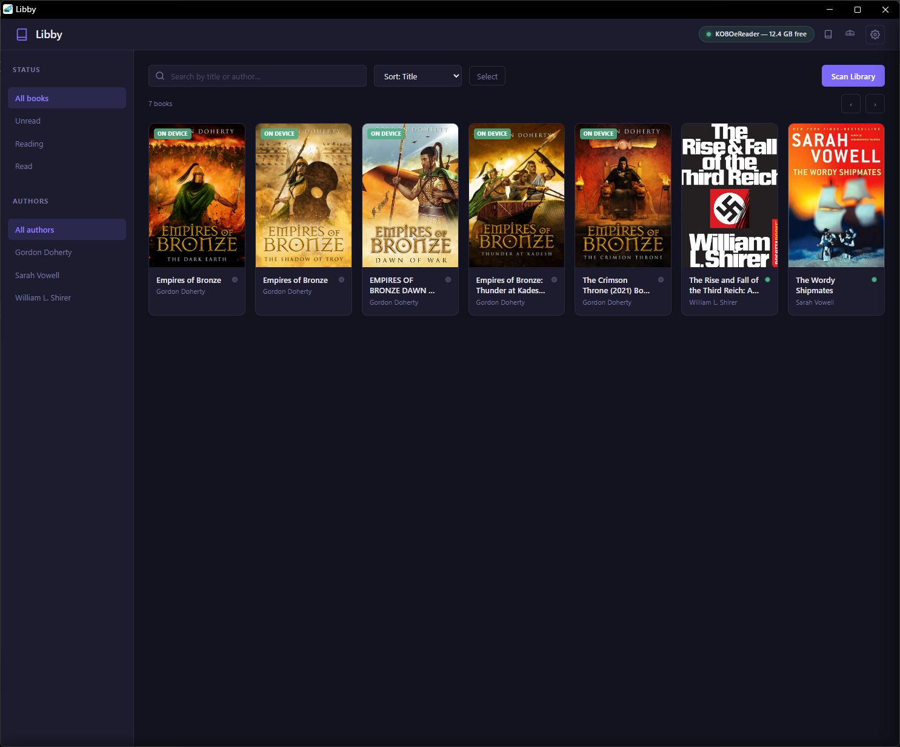

# Libby

A local EPUB library manager for Windows with Kobo device integration.

**No cloud. No DRM. No format conversion. Just EPUBs.**



---

## Features

- **Browse your library** — dark/light theme, search, filter by read status and author, sort
- **Read-status tracking** — cycle books between Unread → Reading → Read with a single click
- **Metadata editing** — edit title, author, and cover image; changes write back to the EPUB file
- **Kobo integration** — auto-detects a connected Kobo and copies books over with one click
- **Library sync** — rescan removes DB records for EPUBs deleted from disk
- **Responsive UI** — works at any window width

---

## Download (Windows exe)

Grab the latest `Libby.exe` from the **[Releases page](https://github.com/joemachen/libby/releases)**.

1. Download `Libby.exe` and place it anywhere (e.g. your Desktop)
2. Double-click to run — a terminal window opens, then your browser
3. Click ⚙ **Settings** and point Libby at your EPUB folder
4. Click **Scan** to import your library

A `data/` folder is created next to `Libby.exe` to store the database and cover images.

> **Windows SmartScreen** may warn about an unsigned executable. Click *More info → Run anyway*.

---

## Run from source

Requires **Python 3.10+**.

```bat
git clone https://github.com/joemachen/libby.git
cd libby
run.bat
```

`run.bat` creates a venv, installs dependencies, and starts the server at `http://127.0.0.1:5000`. Open that URL in your browser, then set your library path via ⚙ Settings.

Alternatively, copy `.env.example` to `.env` and set `LIBRARY_PATH` before running.

---

## Configuration (`.env`)

| Variable            | Default   | Description                                   |
|---------------------|-----------|-----------------------------------------------|
| `LIBRARY_PATH`      | *(none)*  | Folder containing your `.epub` files          |
| `DATA_PATH`         | `./data`  | Where the database and cover images are saved |
| `KOBO_BOOKS_FOLDER` | *(empty)* | Subfolder on Kobo — leave blank for root      |
| `PORT`              | `5000`    | Port the server listens on                    |
| `DEBUG`             | `false`   | Enable Flask debug mode                       |

---

## Development

```bat
python -m venv venv
venv\Scripts\activate
pip install -r requirements.txt

python -m pytest tests/ -v   # run tests
python backend\app.py        # start dev server
```

### Build the exe locally

```bat
pip install pyinstaller
pyinstaller libby.spec
# Output: dist\Libby.exe
```

---

## Releasing a new version

1. Update `VERSION` (e.g. `0.2.0`)
2. Commit and push to `main`
3. Tag and push: `git tag v0.2.0 && git push origin v0.2.0`

GitHub Actions builds `Libby.exe` and publishes a release automatically.

---

## Tech stack

- **Backend:** Python 3.10+, Flask 3, SQLite, ebooklib, Pillow, psutil, waitress
- **Frontend:** Vanilla JS (ES modules), HTML, CSS — no build step
- **Packager:** PyInstaller (single-file Windows exe)

---

## License

[MIT](LICENSE)
